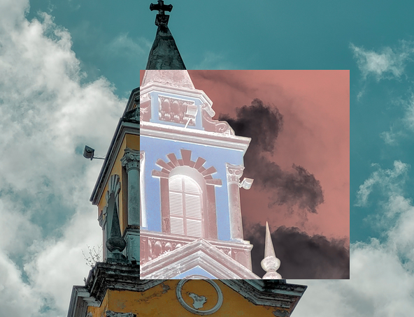
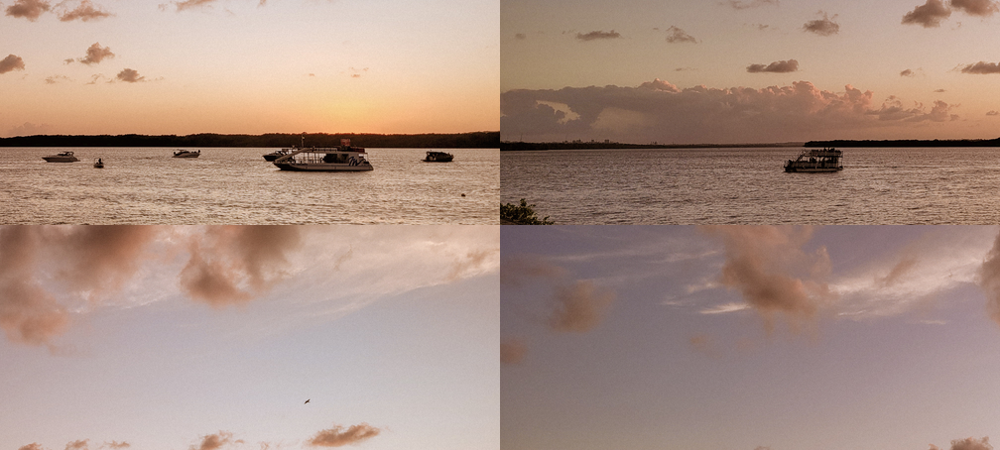
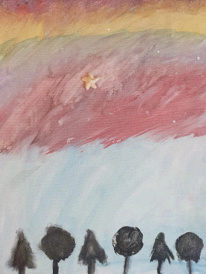
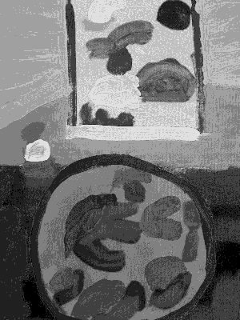
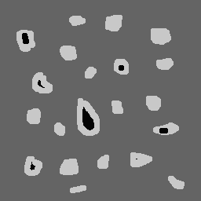

//:stem:
:source-highlighter: rouge
:toc: left

= Processamento Digital de Imagens
Maressa Dâmaris Lima Diógenes

== Introdução
Olá, me chamo Maressa Dâmaris, sou estudante de Engenharia Mecatrônica e este site tem como intúito apresentar a resolução de atividades realizadas ao longo da disciplina de Processamento Digital de Imagens utilizando para a mesma a biblioteca de visão computacional OpenCV em linguagem c++.
Se tiver intesse em utilizar os códigos abaixo, instale a biblioteca OpenCV (sistema Linux):

[source,ruby]
----
sudo apt install libopencv-dev
----
Salve o arquivo makefile no mesmo diretório dos códigos e antes de rodar a sequência de comandos ensinada em cada exercício rode o comando:

[source,ruby]
----
make <nomedoarquivocpp>
----
== 1. Manipulando pixels em uma imagem

=== 1.1 Negativo 

Imagem de entrada:
A figura <<fig_torre>> mostra como incluir imagens no documento

[[fig_torre, torre]]
.Entrada do programa regions

Imagem de saída:
A figura <<fig_regions>> mostra como incluir imagens no documento

[[fig_regions, regions]]
.Saída do programa regions

Incluindo codigo do exemplo <<exa_regions>>. 

[[exa_regions, regions]]
[source,cpp]
.regions.cpp
----
include::codigos/regions.cpp[]
----
Sequência de Comandos:
[source,ruby]
----
make regioes
./regioes torre.png
>>Digite as quatro coordenadas da caixa a0 a1 b0 b1 dentro dos limites
>>numero de linhas:454
>>numero de colunas:592
100 400 200 500
----

=== 1.2 Troca Regiões

Imagem de entrada:
A figura <<fig_praia>> mostra como incluir imagens no documento

[[fig_praia, praia]]
.Entrada do programa regions

Imagem de saída:
A figura <<fig_trocaregies>> mostra como incluir imagens no documento

[[fig_trocaregies, trocaregies]]
.Saída do programa trocaregioes

Incluindo codigo do exemplo <<exa_trocaregioes>>. 

[[exa_trocaregioes, trocaregioes]]
[source,cpp]
.trocaregioes.cpp
----
include::codigos/trocaregioes.cpp[]
----
Sequência de Comandos:
[source,ruby]
----
make trocaregioes
./trocaregioes brooklyn.png
----

== 2. Esteganografia e decomposição de imagens em planos de bits
=== 2.1 Desafio esteganografia

Imagem de entrada:
A figura <<fig_esteg>> mostra como incluir imagens no documento

[[fig_esteg, esteg]]
.Entrada do programa esteg-encode2

Imagem de saída:
A figura <<fig_imagemDecodificada>> mostra como incluir imagens no documento

[[fig_imagemDecodificada, imagemDecodificada]]
.Saída do programa trocaregioes

Incluindo codigo do exemplo <<exa_esteg-encode2>>. 

[[exa_esteg-encode2, esteg-encode2]]
[source,cpp]
.esteg-encode2.cpp
----
include::codigos/esteg-encode2.cpp[]
----
Sequência de Comandos:
[source,ruby]
----
make esteg-encode2
./esteg-encode2 esteg.png
----
== 3. Preenchendo regiões
=== 3.1 Algoritimo labeling aprimorado

Imagem de entrada:
A figura <<fig_bolhas>> mostra como incluir imagens no documento

[[fig_bolhas, bolhas]]
.Entrada do programa bolhas
image::images/bolhas.png[title="entrada do programa bolhas.cpp"]

Imagem de saída:
A figura <<fig_labeling2>> mostra como incluir imagens no documento

[[fig_labeling2, labeling2]]
.Saída do programa trocaregioes

Incluindo codigo do exemplo <<exa_labeling2>>. 

[[exa_labeling2, labeling2]]
[source,cpp]
.labeling2.cpp
----
include::codigos/labeling2.cpp[]
----
Sequência de Comandos:
[source,ruby]
----
make labeling2
./labeling2 bolhas.png
----