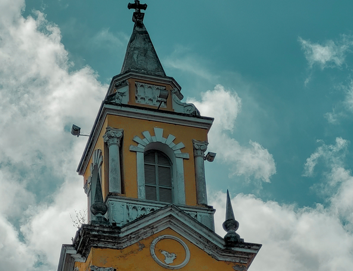

//:stem:
:source-highlighter: rouge
:toc: left

= Processamento Digital de Imagens
Maressa Dâmaris Lima Diógenes
    

== Introdução
Olá, me chamo Maressa Dâmaris, sou estudante de Engenharia Mecatrônica e este site tem como intúito apresentar a resolução de atividades realizadas ao longo da disciplina de Processamento Digital de Imagens utilizando para a mesma a biblioteca de visão computacional OpenCV em linguagem c++.
Se tiver intesse em utilizar os códigos abaixo, instale a biblioteca OpenCV (sistema Linux):

[source,ruby]
----
sudo apt install libopencv-dev
----
Salve o arquivo makefile no mesmo diretório dos códigos e antes de rodar a sequência de comandos ensinada em cada exercício rode o comando:

[source,ruby]
----
make <nomedoarquivocpp>
----
== 1. Manipulando pixels em uma imagem

=== 1.1 Negativo 
O programa <<exa_regions>> usa as coordenadas para dois pontos em uma imagem e inverte os valores de cores no alongamento desses pontos, formando uma região retângular com o efeito de imagem negativo.

Usando como exemplo de entrada a imagem: <<fig_torre>> 

[[fig_torre, torre.png]]
.Entrada do programa regions

Para as coordenas do ponto 1: x=200 e y=100   
Para as coordenas do ponto 2: x=500 e y=400
O resultado é a imgem <<fig_regions>> 
[[fig_regions, regions.png]]
.Saída do programa regions
image::images/regions.png[title="saída do programa regions.cpp"]

Incluindo codigo do exemplo <<exa_regions>>. 

[[exa_regions, regions.cpp]]
[source,cpp]
.regions.cpp
----
include::codigos/regions.cpp[]
----
Sequência de Comandos:
[source,ruby]
----
make regioes
./regioes torre.png
>>Digite as quatro coordenadas da caixa a0 a1 b0 b1 dentro dos limites
>>numero de linhas:454
>>numero de colunas:592
100 400 200 500
----

=== 1.2 Troca Regiões

Imagem de entrada:
O programa <<exa_trocaregioes>> inverte diagonalmente os quadrantes de uma imagem.
A figura <<fig_praia>> mostra um exemplo de entrada

[[fig_praia, praia.png]]
.Entrada do programa regions

Imagem de saída com os quadrantes trocados: <<fig_trocaregies>> 

[[fig_trocaregies, trocaregioes.png]]
.Saída do programa trocaregioes

Código do programa <<exa_trocaregioes>>: 

[[exa_trocaregioes, trocaregioes.cpp]]
[source,cpp]
.trocaregioes.cpp
----
include::codigos/trocaregioes.cpp[]
----
Sequência de Comandos:
[source,ruby]
----
make trocaregioes
./trocaregioes brooklyn.png
----

== 2. Esteganografia e decomposição de imagens em planos de bits
=== 2.1 Desafio esteganografia

A esteganografia é uma técnica de ocultação de informações que consiste em esconder dados em meio a outros dados, de modo que sua presença seja imperceptível. Com esse intuito o programa <<exa_esteg-encode2>> cumpre o desafio de decompor as camadas de bits da imagem <<fig_esteg>> e apagar os bits mais significativos a fim de encontrar a imagem escondida nos bits menos significativos.

Imagem de entrada:

[[fig_esteg, esteg.png]]
.Entrada do programa esteg-encode2
image::images/esteg.png[title="entrada do programa esteg-encode2.cpp"]

A figura decodificada <<fig_imagemDecodificada>> 

[[fig_imagemDecodificada, imagemDecodificada.png]]
.Saída do programa trocaregioes

Código do programa <<exa_esteg-encode2>>:

[[exa_esteg-encode2, esteg-encode2.cpp]]
[source,cpp]
.esteg-encode2.cpp
----
include::codigos/esteg-encode2.cpp[]
----
Sequência de Comandos:
[source,ruby]
----
make esteg-encode2
./esteg-encode2 esteg.png
----

== 3. Serialização de dados em ponto flutuante via FileStorage
=== 3.1 Algoritimo filestore modificado

    Utilizando o programa filestorage.cpp como base, crie um programa que gere uma imagem de dimensões 256x256 pixels contendo uma senóide de 4 períodos com amplitude de 127 desenhada na horizontal, como aquela apresentada na Figura 6 . Grave a imagem no formato PNG e no formato YML. Compare os arquivos gerados, extraindo uma linha de cada imagem gravada e comparando a diferença entre elas. Trace um gráfico da diferença calculada ao longo da linha correspondente extraída nas imagens. O que você observa?

Saída do filestorage <<fig_senoide>>:

[[fig_senoide, senoide.png]]
.Saída do programa trocaregioes
image::images/senoide.png[title="saída do programa filestorage.cpp"]

Saída do filestorage2 <<fig_senoide2>>:

[[fig_senoide2, senoide2.png]]
.Saída do programa trocaregioes

Plot de uma linha dos dados do arquivo yml gerados, no canto esquerdo um plot de senoide.png e do lado direito a de senoide2.png:

[[fig_plot, plot.png]]
.Saída do programa trocaregioes

Código do programa <<exa_filestorage2>>:

[[exa_filestorage2,filestorage2.cpp]]
[source,cpp]
.filestorage2.cpp
----
include::codigos/filestorage2.cpp[]
----
Sequência de Comandos:
[source,ruby]
----
make filestorage2
./filestorage2 
----

== 4. Preenchendo regiões
=== 4.1 Falha no algoritimo labeling

    Observando-se o programa labeling.cpp como exemplo, é possível verificar que caso existam mais de 255 objetos na cena, o processo de rotulação poderá ficar comprometido. Identifique a situação em que isso ocorre e proponha uma solução para este problema.

O problema encontrado no codigo labeling.cpp é que ele usa a cor do pixel para contar os elementos encontrados, ou seja, seu valor se limita ao que a cor pode representar, que no caso é 255. Para resolver este problema, o código <<exa_labeling2>> mostra uma solução separando um contador exclusivo para isso(nBuracos).

=== 4.2 Algoritimo labeling aprimorado

    Aprimore o algoritmo de contagem apresentado para identificar regiões com ou sem buracos internos que existam na cena. Assuma que objetos com mais de um buraco podem existir. Inclua suporte no seu algoritmo para não contar bolhas que tocam as bordas da imagem. Não se pode presumir, a priori, que elas tenham buracos ou não.

Para resolver este exercício foi criado o programa <<exa_labeling2>>
Imagem de entrada: <<fig_bolhas>>

[[fig_bolhas, bolhas.png]]
.Entrada do programa bolhas
image::images/bolhas.png[title="entrada do programa bolhas.cpp"]

Imagem de saída: <<fig_labeling2>> 

Saída do programa:
[source,ruby]
----
256x256
a figura tem 21 bolhas
a figura tem 7 buracos
----

[[fig_labeling2, labeling2.png]]
.Saída do programa trocaregioes
image::images/labeling2.png[title="saída do programa labeling2.cpp"]

Código do programa <<exa_labeling2>>:

[[exa_labeling2, labeling2.cpp]]
[source,cpp]
.labeling2.cpp
----
include::codigos/labeling2.cpp[]
----
Sequência de Comandos:
[source,ruby]
----
make labeling2
./labeling2 bolhas.png
----
== 5.Manipulação de Histogramas
=== 5.1 Equalização de Histograma

Imagem de entrada:

[[fig_igreja, igreja.png]]
.Saída do programa equalize

Imagens de saída:
A figura <<fig_histogram>> mostra a imagem original em escala de cinza com o seu histograma

[[fig_histogram, histogram.png]]
.Saída do programa equalize

A figura <<fig_equalize>> mostra a imagem em escala de cinza com o seu histograma equalizado

[[fig_equalize, equalize.png]]
.Saída do programa equalize

Código do programa <<exa_equalize>>:

[[exa_equalize, equalize.cpp]]
[source,cpp]
.equalize.cpp
----
include::codigos/equalize.cpp[]
----
Sequência de Comandos:
[source,ruby]
----
make equalize
./equalize igreja.png
----